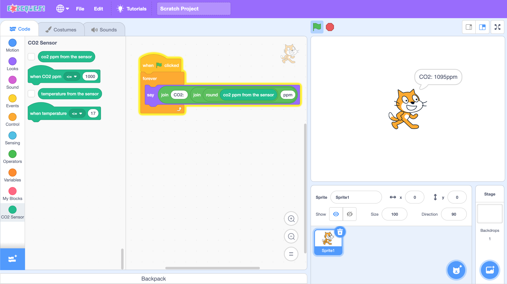
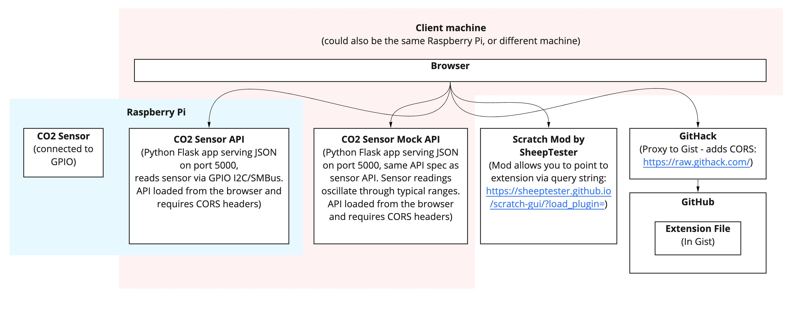
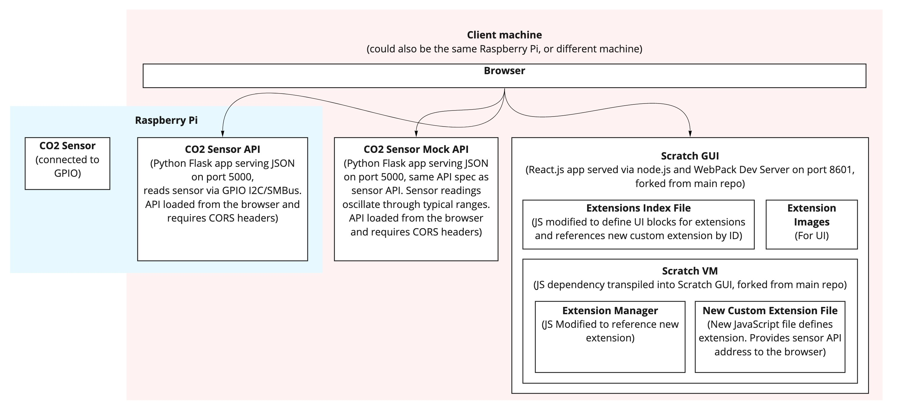

# co2sensorscratch



A project to help people learn to code using Scratch, integrating with a real world CO2 sensor which could be used as a safety monitor for adequate ventilation for COVID-19.

# Options

The user-interface to this is a Scratch Extension, running in Scratch. There are three main ways to get this running:
- Open the URL with Scratch hosted via SheepTester and the plugin hosted via a GitHub gist, proxied through GitHack: [EXAMPLE](https://sheeptester.github.io/scratch-gui/?load_plugin=https://gist.githack.com/onlypixels/caa4001c37df7a5788457d081830951a/raw/d0c77a0ded164136748303af8c6776816db90c23/scratch_extension_temp001.js)
- Host the extension yourself, possibly through a GitHub gist and [GitHack](https://raw.githack.com/)
- Download [scratch-gui](https://github.com/LLK/scratch-gui) and [scratch-vm](https://github.com/LLK/scratch-vm) and modify these to add the plugin

# Architecture

There are two main architectures:

## SheepTester URL



SheepTester hosts a mod of Scratch that allows you to load extensions into Scratch. The extension is hosted in GitHub in a gist and proxied via GitHack to enable CORS. The extensions run as JavaScript within scratch and points to a URL with a JSON API (with CORS) that's connected to the sensor via SMBus. Alternatively theres a mock API that cycles through values so you can more easily test your Scratch program with changes in sensor values.

All this can be run on a Raspberry PI. Alternatively, you can have the Raspberry Pi host the sensor and API only, then run scratch on a different client machine.

## Scratch development environment



More involved, but you can clone the Scratch GUI and Scratch VM repos to your machine, link them and modify them to include the extension. The extension will then run as JavaScript within Scratch within the browser. The JavaScript will call the API using CORS.

All this can be run on a Raspberry PI. Alternatively, you can have the Raspberry Pi host the sensor and API only, then run scratch on a different client machine.

# Setting up the Raspberry PI

## Hardware
- [Raspberry Pi 4b](https://thepihut.com/collections/raspberry-pi-kits-and-bundles/products/raspberry-pi-starter-kit) (here's a starter pack, but you can just get the Pi if you have the rest)
- [Advanced CO2 Sensor Breakout Board for Raspberry Pi (EE895) by Pi3g](https://thepihut.com/products/advanced-co2-sensor-breakout-board-for-raspberry-pi)

Ensure you have Raspbian.

## Installing the sensor API

Clone the repo for the [CO2 sensor](https://github.com/onlypixels/co2sensor) and follow the instructions to set up and run it.

Install the [CO2 sensor mock](https://github.com/onlypixels/co2sensormock) if you'd like faster feedback when writing your Scratch program


# Setting up the extension in Scratch

## Option: SheepTester URL

Modify `./src/index.js`. Edit the value `API_URL` to point to your API if needed.

Create a gist on [GitHub](https://github.com/_) using the file in `scratch-vm/src/extensions/scratch3_co2sensor/index.js`.

Go to the raw file and copy the link.

Paste it into [GitHack](https://raw.githack.com/).

Copy the dev URL from GitHack

Append that URL to the SheepTester base URL: https://sheeptester.github.io/scratch-gui/?load_plugin=

E.g. https://sheeptester.github.io/scratch-gui/?load_plugin=https://gist.githack.com/onlypixels/caa4001c37df7a5788457d081830951a/raw/d0c77a0ded164136748303af8c6776816db90c23/scratch_extension_temp001.js

## Option: Dev Environment

Follow the instructions here to clone both Scratch GUI and Scratch VM

### Modify Scratch VM
Copy each of the files under the scratch-vm folder into the same location in the scratch vm you just cloned.

Edit ./src/extension-support/extension-manager.js:

Add the line
```javascript
co2sensor: () => require('../extensions/scratch3_co2sensor')
```
inside the builtinExtensions object (remembering the comma), e.g.:
```javascript
const builtinExtensions = {
    // This is an example that isn't loaded with the other core blocks,
    // but serves as a reference for loading core blocks as extensions.
    coreExample: () => require('../blocks/scratch3_core_example'),
    ...
    co2sensor: () => require('../extensions/scratch3_co2sensor')
};
```

### Modify Scratch GUI

In scratch GUI edit /src/lib/libraries/extensions/index.jsx

Add the following entry (not forgetting the comma) to the end of the array exported:

```jsx
    {
        name: 'CO2Sensor',
        extensionId: 'co2sensor',
        collaborator: 'Ben Pitman',
        description: (
            <FormattedMessage
                defaultMessage="CO2Sensor"
                description="my co2 sensor block"
                id="gui.extension.co2sensor.description"
            />
        ),
        featured: true,
        disabled: false,
        internetConnectionRequired: true,
        bluetoothRequired: false,
        helpLink: 'https://github.com/onlypixels/co2sensorscratch'
    }
```

# What are good readings for CO2?

CO2 monitors measure whether rooms have good ventilation and are a good proxy measure for the level of atmospheric COVID that could be present if someone has COVID in a shared space.

Outdoor background CO2 is around 400 parts per million (PPM). Over 1,000 in a shared indoor space is seen to be problematic. Generally businesses should aim to be below 1,000 or below 800 by some recommendations or below 700 for environments where people could emit more COVID (e.g. singing, shouting children).

- [UK Health and Safety Executive Advice](https://www.hse.gov.uk/coronavirus/equipment-and-machinery/air-conditioning-and-ventilation/identifying-poorly-ventilated-areas.htm)

- [Smart Buildings article on the German Environment Agency advice](https://smartbuildingsmagazine.com/features/carbon-dioxide-monitoring-to-lower-the-coronavirus-threat)

# Ideas for exercises for learning programming
- Make the cat say the current CO2 ppm when hitting go
- Make the cat say the current CO2 ppm in the format: "The current CO2 level is XXX ppm" when hitting go
- Make the cat forever say the current CO2 level
- Make the cat say "Open the windows!" when the CO2 level is above 1000 ppm
- Make the cat say "Open the windows!" when the CO2 level is above 1000 ppm, say nothing when it goes the same as or below 1000
- Make the cat say "Open the windows!" when the CO2 level is above 1000 ppm and say "Close the windows!" when it's BOTH less than or equal to 1000 AND the temperature is below 18 degrees C
